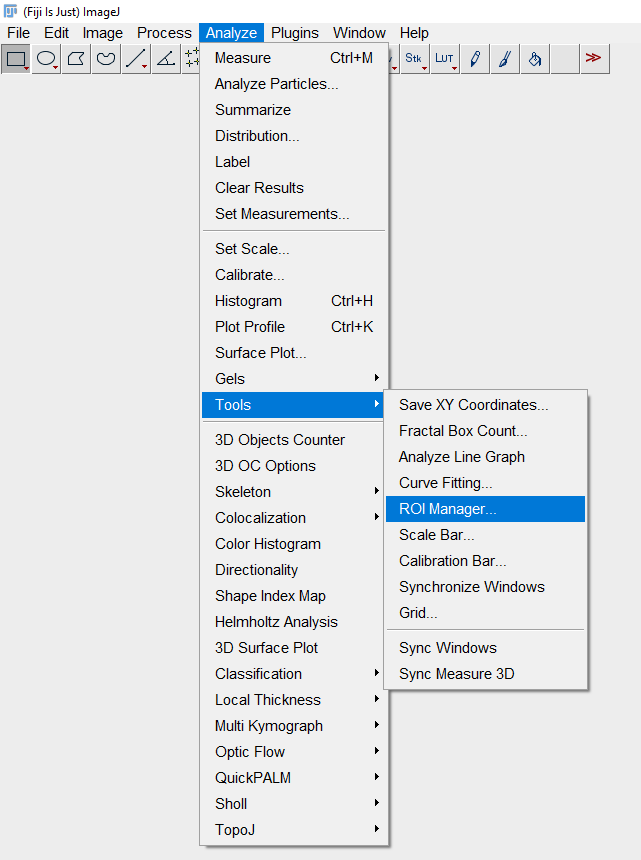
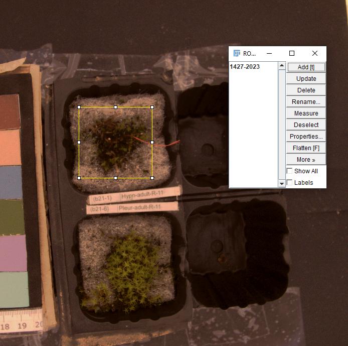

## Image pre-processing:

A **ImageJ** _imj_ macro repository providing tools to paired images alignment and histogram matching within a picture series. 
We use ImageJ because it is open-source, very accessible and familiar in biological sciences, fitting with our main goal to develop an free and accessible protocol.

**Note**: You can download ImageJ in <https://imagej.nih.gov/ij/download.html> 

---
### Alignment:

Allow NIR-VIS pictures perfectly match for spectral index calculation. 
* [**Alignment_Process_Folder_v1.ijm**](./Alignment_Process_Folder.ijm)
* [**Alignment_Process_Folder diagram**](./Alignment_Process_macro_diagram.drawio.png)

**Note**: NIR and VIS paired images must be in the same order in its respective directories.

---

### Histogram homogenization:

Homogenization reduces exposure differences between images. We select one image from each NIR/VIS series to use it as histogram reference to match the rest of histograms within picture series. 
* [**Histomatch_Process_Folder.ijm**](https://github.com/MMolBus/photomoss/blob/master/vignettes/vignette_ImageJ_preprocessing/Histomatch_Process_Folder_v1.ijm)
* [**Histomatch_Process_Folder diagram**](./Histomatch_Process_Folder_v1_diagram.drawio.png)
---
### Create Region Of Interest (ROI) files:

Use ImageJ Roi Manager to create ROI files.

Figure 2 shows how to open ROI Manager in ImageJ
(*Analyze* -> *Tools* -> *ROI Manager*) 

Figure 3 shows how to select the ROI area creating a polygon. 

**Note**: It is important to save the ROIs in the same order you will analyze the images of each image.

*Figure 2. how to open ROI Manager in ImageJ*

*Figure 3. How to select the ROI area creating a polygon. Click in 'Add' or 't' as keyboard shortcut to record the ROI.*

